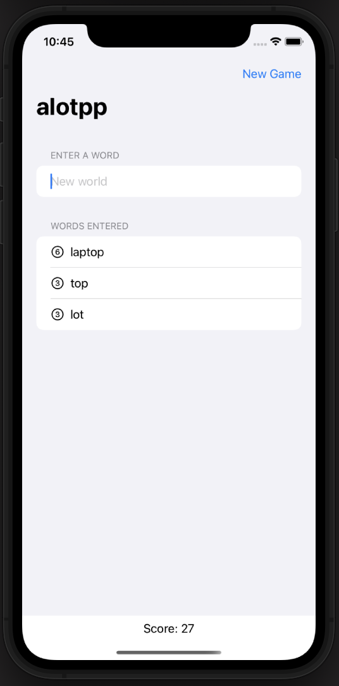
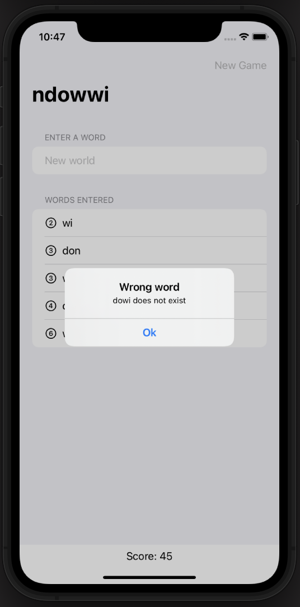

# Scramble

Hi there!

Today’s upload is a game, so it is something a little different from what I am used to post. The game is called Scramble, I know that this name might sound familiar to you, whereas I will explain what all this game is about. On Scramble you get some letter and you must insert words that you can write with them. So that, the longer and the more words you get, the better score.

To build this app I used the following views, classes, methods, and modifiers:

OnAppear: modifier that allows us to execute some code whenever the attached view is presented to the user.

OnSubmit: as OnAppear it allows us to execute some code but this time when we pressed enter while editing a textField. 

UITextChecker: object to check a String (usually text of a document) for misspelled words. To do this, we used its method “rangeOfMisspelledWord(…)” 

Alert: a representation of an alert presentation.

Bundle: class that allows us to access to files and resources stored in a bundle directory or disk. We use it to access a text file containing a list of words.

FatalError(_ message:String): Function that immediately stops the execution of our app. In this case it is used to stop the app when trying to work with no loaded words.

###### Main Screen

###### Alert Message when a word is wrong

